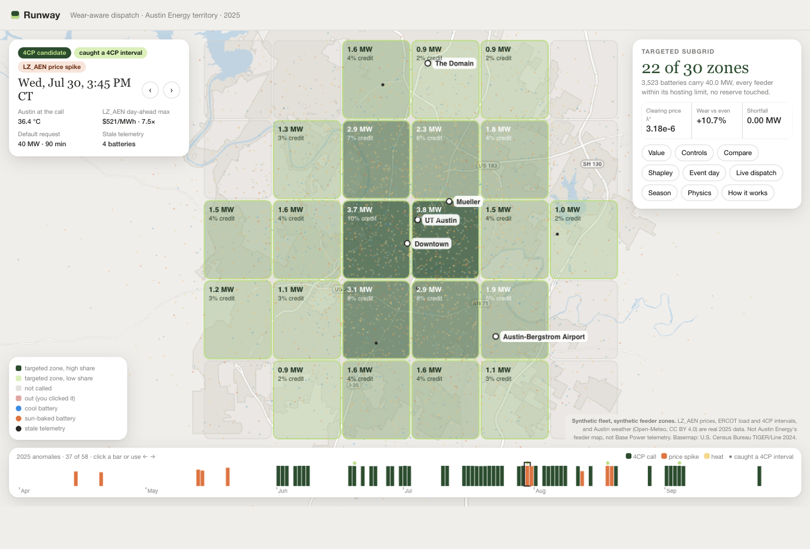
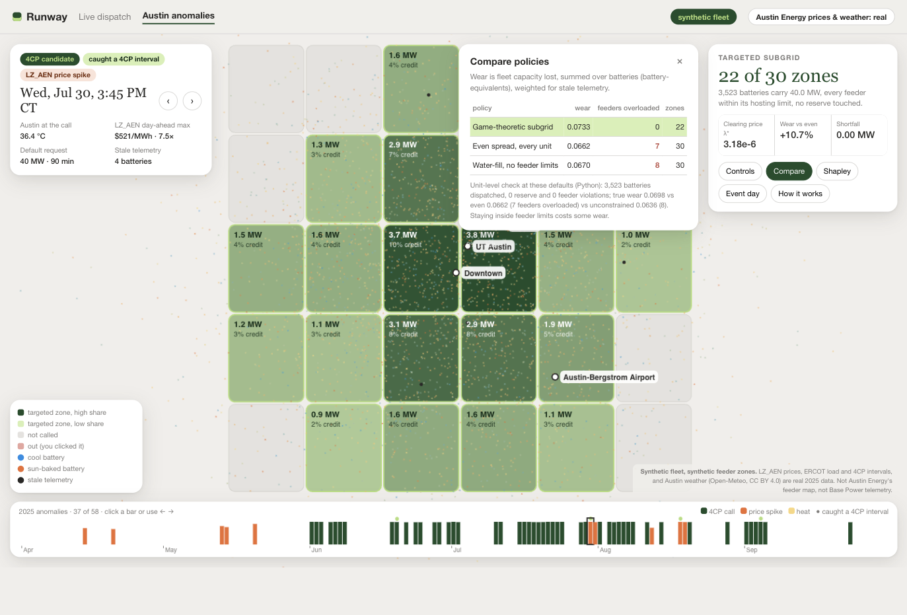

# Runway

[](https://github.com/tmgorusu/runway/actions/workflows/tests.yml)

**Wear-aware dispatch for utility-called home batteries.** When a utility calls a fleet of home batteries for 40 MW, Runway decides which homes deliver it. The same kWh costs a sun-baked battery more of its life than a shaded one, so Runway fills the megawatts where they wear the fleet least. It never draws backup reserve, and when the fleet can't cover a call it reports the shortfall.



> **What is real and what is not.** The ERCOT 2025 system load, day-ahead forecast, and published 4CP intervals are real public data, and so is the Austin weather. The battery fleet is a **synthetic fleet** of Base Core-sized units (20 kW, 39.2 kWh, LFP). Its telemetry is a synthetic stand-in for what a fleet operator would plausibly report. There is no Base Power data here, and nothing claims how Base Power dispatches.

## Results

Every number below comes from a file the one command writes.

| | Result | Source |
|---|---|---|
| **Track 1: 2025 hunt** | 52 candidate days under a 0.97 day-ahead rule, committed before any hit file existed. All 4 published 2025 4CP intervals were caught. | `handoff/hit_flags.json` |
| | 91.9% of summer call wear lands on calls that missed every 4CP interval. Under even spread, a kWh on a missed call costs 0.946× a kWh on a hit (low 1.000, high 0.918): a miss is not cheaper. | `outputs/track1/hero.json` |
| **Why routing matters** | Two units deliver the same 15 kWh on the hottest call. The sun-baked one loses 1.27× the capacity of the shaded one. | `outputs/physics/reference_pair.json` |
| | Across the summer replay, Runway uses the least total capacity of the three policies in every assumption set. Over the hero calls it uses 3.4% less than even spread and 29% less than most-charge-first. | `outputs/replay/detail.json`, `outputs/track1/hero.json` |
| **Track 2: orchestration** | 4,000 async unit workers take a seeded fault: the 15% holding the largest setpoints go offline. The dispatcher re-solves in 89 ms wall-clock and still delivers 40.000 MW, with 0 shortfall and 0 reserve violations. | `outputs/track2/metrics.json` |
| | The dispatcher process is SIGKILLed mid-call and restarted from its write-ahead journal. Each setpoint batch commits exactly once. | `outputs/track2/restart.log` |
| | `allocate()` median time on an Apple M2: 9 ms at 1,000 units, 79 ms at 10,000, 835 ms at 100,000. | `outputs/bench/allocate.json` |
| **Physics check** | The aging model matches NREL BLAST-Lite (LFP) within 0.2% on calendar fade (25 and 45 °C) and 1.4% on cycle fade (25 °C), with zero fitted parameters. | `outputs/physics/blast_overlay.json` |
| | Each unit's thermal exposure is fitted from two months of synthetic telemetry. It tracks the hidden truth with correlation 0.996. The installer's raw sun exposure alone gets 0.50. | `outputs/physics/telemetry_fit.json` |

**Limits we report rather than hide:**
- The 2,000-unit fleet asked for 40 MW falls 5.8 MW short on the average call under every policy, because leveling cannot create megawatts.
- Called every day for ten years (the over-call fixture), every policy loses the same 236 units.
- The Runway effect rests on the cycle-aging activation energy. With BLAST-Lite's small-cell LFP data, where temperature doesn't affect cycling, the hot/cool difference disappears (ratio 1.000).

## Austin anomaly map



`web/austin.html` is an interactive map of the Austin Energy territory. It covers the 58 anomaly days between April and September 2025 under a rule fixed before the first run: 52 4CP candidate calls, 10 LZ_AEN day-ahead price spikes, and 2 heat anomalies. For each day it picks which of 30 synthetic feeder zones to call, using three layers:

- **Clearing price (Stackelberg).** The utility posts a flexibility price. Each zone offers every kW whose marginal wear is at or below that price, up to its hosting limit. Marginal wear includes enclosure heat, BMS health, cycles, C-rate, and stale telemetry.
- **Coalition.** Calling a zone has a fixed activation cost, so a local search drops and adds zones until wear plus activation cost stops falling. The zones left are the targeted subgrid.
- **Shapley credit.** Each zone's share of the coalition's value, a fair basis for splitting the payment.

Click a zone to simulate a feeder outage, or drag the request, activation-cost, and hosting-limit sliders; the browser re-solves in under 100 ms. A test runs the browser solver in Node and checks it matches the Python solver exactly.

On the July 30 4CP call, the game targets 22 of 30 zones and 3,523 batteries, with no feeder overloaded and no reserve touched. That costs 5.5% more true wear than even spread (10.7% on the stale-telemetry-weighted cost the game optimizes); even spread overloads 7 feeders. The feeder zones and hosting limits are synthetic assumptions, not Austin Energy's feeder map (`outputs/austin/events.json`).

## Run it

Python 3.12+. The network is needed only to install.

```bash
uv sync                                                        # or: python -m venv .venv && .venv/bin/pip install -r requirements.txt
uv run python -m runway.demo --seed 7 --fault offline_wave     # the product (~1 min on first run, seconds after)
open web/index.html                                            # dashboard, works from file:// offline
uv run pytest                                                  # 115 tests; every test blocks the network
```

The demo command is also the chaos test. It reads the offline cache, dispatches one call across the synthetic fleet, injects the seeded offline wave, re-solves, and writes every artifact. Wear's hero ratio, replay, BLAST overlay, and telemetry fit are rebuilt only when their inputs change.

| Command | Writes |
|---|---|
| `python -m runway.demo --seed 7 --fault offline_wave` | `outputs/track2/metrics.json`, `outputs/demo/decision_table.csv`, `outputs/bench/allocate.json`, `web/index.html`, `VIDEO_SCRIPT.md`, plus the Wear artifacts below |
| `python -m runway.wear` | `outputs/track1/hero.json`, `outputs/replay/{summary,detail}.json`, `outputs/physics/*.json`, `outputs/telemetry/fleet_estimates.parquet`, `PHYSICS_LINES.md` |
| `python -m runway.calendar` | `handoff/calls.parquet`, `handoff/hit_flags.json` from `CALLING_RULE.md` |
| `python -m runway.telemetry` | `data/telemetry/`: synthetic Base-like registry and daily unit telemetry, April–September 2025 |
| `python -m runway.dispatcher --ladder` | `outputs/track2/ladder.json`: the largest fleet (4,000 / 2,000 / 500) that re-solves in under one second |
| `python -m runway.ingest --offline` | verifies `data/` against `data/manifest.json` (`uv sync --extra ingest && python -m runway.ingest` refreshes it from the network) |

## How it works

```text
ERCOT 2025 load + day-ahead forecast + published 4CP      Austin weather (Open-Meteo)
                 │                                                │
                 ▼                                                ▼
   calendar: CALLING_RULE.md (0.97, hashed) ──► handoff/calls.parquet
                 │
synthetic telemetry ──► telemetry_fit ──► seed-7 fleet (age, exposure, health, cycles)
                 │
                 ▼
   allocate(call, units, policy)
     runway:      water-fill on marginal_wear = d/dP [ age( step_thermal(...) ) ]
     even, most_charge: baselines under the same reserve guard
                 │
                 ▼
   dispatcher + one async worker per unit: heartbeats, write-ahead journal, re-solve, restart
                 │
                 ▼
   hero.json · summary.json · metrics.json · decision_table.csv · allocate.json · web/index.html
```

- **Thermal model** (`runway/thermal.py`): a lumped enclosure model with ambient exchange, solar gain scaled by sun exposure, and resistive heating. It is integrated exactly.
- **Aging model** (`runway/aging.py`): calendar and cycle fade in the form of BLAST-Lite's large-format LFP model. The cycle term uses an Arrhenius temperature dependence (Wang et al. 2011) and a C-rate term. Three assumption sets live in `assumptions/`, with every number labeled sourced or assumption.
- **Marginal wear** (`runway/marginal.py`): the forward difference of call wear with respect to power. It is nondecreasing in power by construction, which the water-fill needs.
- **Allocator** (`runway/allocate.py`): a threshold water-fill over a 21-point power grid for each unit. Power stays within the unit's limits and energy above reserve, delivered kW plus shortfall equals the request, and the same inputs give the same output.
- **Dispatcher** (`runway/dispatcher.py`, `runway/worker.py`, `runway/journal.py`): asyncio actors in one process, heartbeat timeouts, a write-ahead journal with monotonic sequence numbers, and a subprocess-kill restart test.

## Assumptions

- Backup reserve is 0.30 of capacity, and a unit is replaced when its health falls below 0.70.
- The replay fleet is 4,000 units serving 40 MW; the saturation row is 2,000 units.
- Every hero call starts at SOC 1.0.
- ERCOT system load stands in for the Austin Energy, GVEC, and CoServ peak hunts.
- `peak_odds` is a score, not a probability.
- The labels appear in the code, the outputs, the dashboard, and `PHYSICS_LINES.md`.

## Repository map

| Path | What it is |
|---|---|
| `runway/` | The package: `contracts`, `fleet`, `ingest`, `calendar`, `allocate`, `worker`, `dispatcher`, `demo`, `web` (Machine), and `thermal`, `aging`, `marginal`, `policies`, `hero`, `replay`, `overlay`, `telemetry`, `telemetry_fit` (Wear) |
| `data/` | Offline cache: ERCOT and weather Parquet with a manifest, and synthetic telemetry |
| `outputs/` | Every artifact the video and dashboard cite |
| `CALLING_RULE.md` | The pre-registered calling rule; its sha256 is on every call |
| `PHYSICS_LINES.md`, `VIDEO_SCRIPT.md` | Generated narration, every number with its source file |
| `physics/` | BLAST-Lite reference run and the script that produced it (separate Python 3.12 environment) |
| `docs/` | The merged spec (`VISION.md`), the two half-specs (`WEAR.md`, `MACHINE.md`), the build plan with its council record, and task cards |

## Data sources and credits

- ERCOT system demand and day-ahead demand forecast: U.S. EIA Hourly Electric Grid Monitor (EIA-930), public domain.
- Published 2025 4CP intervals: ERCOT report NP9-83-M, Four Coincident Peak Calculations.
- Day-ahead settlement point prices (cached only; never used by the allocator): ERCOT NP4-180-ER via gridstatus.
- Hourly temperature: [Open-Meteo](https://open-meteo.com/) historical weather API (ERA5), CC BY 4.0.
- Aging reference: NREL [BLAST-Lite](https://github.com/NREL/BLAST-Lite) 1.1.1 (Apache-2.0), run once to produce `physics/blast_lite_reference.csv`. Runway does not import or redistribute BLAST-Lite code.
- Cycle-aging activation energy: J. Wang et al., "Cycle-life model for graphite-LiFePO4 cells," *J. Power Sources* 196 (2011) 3942–3948.

© 2026 the Runway authors. All rights reserved. No license is granted.
